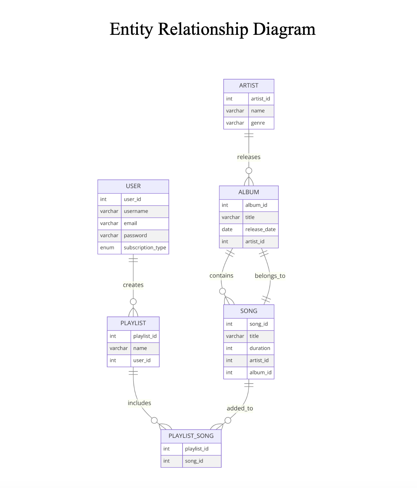

# 🎵 Spotify Database Design – Group Project

## 📦 Overview
This group project focuses on designing a **relational database** model for a music streaming platform similar to **Spotify**. The work was completed as part of the *IT Platforms* course and includes schema creation, ERD, normalization, and documentation.

---

## 🎯 Objectives

- Design a relational database schema for core Spotify features  
- Define entities, relationships, and constraints  
- Create an **Entity Relationship Diagram (ERD)**  
- Apply **1NF, 2NF, 3NF normalization**  
- Provide documentation and rationale for design choices

---

## 🧰 Technologies & Tools

- 🛢️ **SQL** – for schema definition and data modeling  
- 📐 **ERD tools** – such as Draw.io / Lucidchart to visualize relationships  
- ⚙️ **Relational Database Design** – tables, constraints, keys  
- 🧹 **Database Normalization** – applied 1NF, 2NF, and 3NF  
- 📝 **PDF Documentation** – with design process and justifications

---

## 📂 File Contents

- `Spotify_DB_Design_Report.pdf` – Full report including:
  - Database model & description  
  - ERD (Entity-Relationship Diagram)
  - Normalization steps (1NF, 2NF, 3NF levels) 
  - Final SQL schema (with explanation)  

- `README.md` – Project summary and structure


## 🗃️ Database Schema (SQL)

### 🔹 User
```sql
CREATE TABLE User (
  user_id INT PRIMARY KEY,
  username VARCHAR(20) NOT NULL UNIQUE,
  email VARCHAR(50) NOT NULL UNIQUE,
  password VARCHAR(100) NOT NULL,
  subscription_type ENUM('Free', 'Premium')
);
```
### 🔹 Artist
```sql
CREATE TABLE Artist (
  artist_id INT PRIMARY KEY,
  name VARCHAR(255) NOT NULL,
  genre VARCHAR(50) NOT NULL
);
```

### 🔹 Album
```sql
CREATE TABLE Album (
  album_id INT PRIMARY KEY,
  title VARCHAR(255) NOT NULL,
  release_date DATE,
  artist_id INT,
  FOREIGN KEY (artist_id) REFERENCES Artist(artist_id)
);
```

### 🔹 Song
```sql
CREATE TABLE Song (
  song_id INT PRIMARY KEY,
  title VARCHAR(255) NOT NULL,
  duration INT,
  artist_id INT,
  album_id INT,
  FOREIGN KEY (artist_id) REFERENCES Artist(artist_id),
  FOREIGN KEY (album_id) REFERENCES Album(album_id)
);
```

### 🔹 Playlist
```sql
CREATE TABLE Playlist (
  playlist_id INT PRIMARY KEY,
  name VARCHAR(255) NOT NULL,
  user_id INT,
  FOREIGN KEY (user_id) REFERENCES User(user_id)
);
```

### 🔹 Playlist_Song (many-to-many)
```sql
CREATE TABLE Playlist_Song (
  playlist_id INT,
  song_id INT,
  PRIMARY KEY (playlist_id, song_id),
  FOREIGN KEY (playlist_id) REFERENCES Playlist(playlist_id),
  FOREIGN KEY (song_id) REFERENCES Song(song_id)
);
```

---

## 🖼️ Entity Relationship Diagram (ERD)

The diagram below shows the structure of the database with main entities and their relationships.


